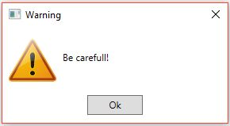
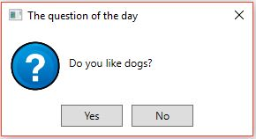
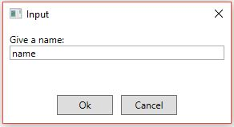
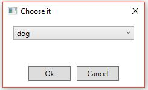
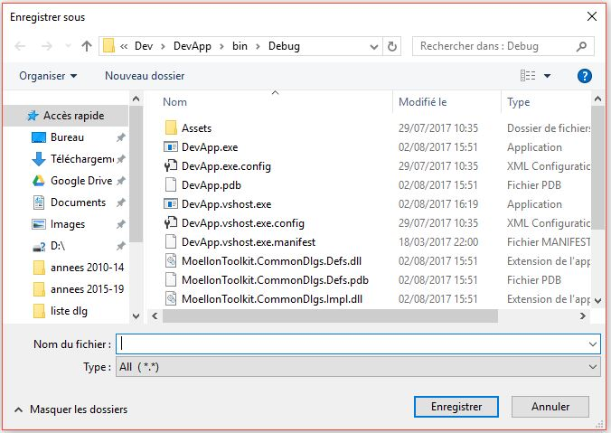

# What is MoellonToolkit?
 MoellonToolkit is a small and basic framework designed for building WPF applications with the focus on the MVVM pattern.
The framework provides a generic back-end application controller with some convenient ready to use dialog boxes like: Error, Warning, Question, Information, InputText, Select Text,...
These functionalities will enable developers to build solutions very easily. 
The framework is developed in C# 4.0.  

# List of implemented dialog boxes

The classic error message box:

	commonDlg.ShowError("You're wrong.");

The Information message box:

	commonDlg.ShowInformation("Yes, you like dogs.");

The Warning message box:

	commonDlg.ShowWarning("Be carefull!");

The Question message box:

	commonDlg.ShowQuestion("Do you like dogs?");

The Extra Large Width Information message box:

	string msg = "Yes, you like dogs, cats, birds, horses, worms, lions, ants, girafs, rabbits, ...";
	commonDlg.ShowInformation(WHSize.WXL, msg);

The Input text message box:

	string text;
    CommonDlgResult res = commonDlg.ShowDlgInputText("Input", "Give a name:", "name", out text);
    if (res != CommonDlgResult.Ok)
    {...}

The large width Input text message box:

	string text;
    CommonDlgResult res = commonDlg.ShowDlgInputText(WHSize.WL, "Input", "Give a name:", "name", out text);
    if (res != CommonDlgResult.Ok)
	{ ... }

The combo choice dialog box:

The list choice dialog box:

	List<DlgComboChoiceItem> listItem = new List<DlgComboChoiceItem>();
    DlgComboChoiceItem selectedBeforeItem = null;

    // create some object
    List<string> listString = new List<string>();
    listString.Add("dog");
    listString.Add("cat");
    listString.Add("horse");
    listString.Add("duck");

    foreach (string s in listString)
    {
        var item = new DlgComboChoiceItem(s, s);
        listItem.Add(item);
    }

    DlgComboChoiceItem selected;
    CommonDlgResult res = commonDlg.ShowDlgComboChoice("Choose it", listItem, selectedBeforeItem, out selected);

    if (res == CommonDlgResult.Ok)
	{...}

The select file  dialog box:
(Use the Windows built-in dialog box.)

	res = commonDlg.ShowDlgSelectFile("C\\", "*.*", "All | *.*", out pathName, out fileName);
    if (res == CommonDlgResult.Ok)
	{ ... }

The save file  dialog box:

(Use the Windows built-in dialog box).

	res = commonDlg.ShowDlgSaveFile("C\\", "", "All | *.*", out pathName, out fileName);
    if (res == CommonDlgResult.Ok)
	{ ...}

The images of these dialog boxes are the folder: Docs\Dialogs.

	
# Quick Getting Started 
Create a WPF project. Create your back-end application controller class based on the MoellonToolkit base controller.
Create your Views and ViewModels, update the controller.

For more details, see the application sample named DevApp provided in the solution in the Dev folder.

## Use defined dialog boxes
You can just use the common dialog boxes provided by the framework, without the back-office application controller.

Use the ICommonDlg interface and the concrete implementation CommonDlg. The very basic way is:

    ICommonDlg commonDlg = new CommonDlg();

Sample:	Display a dialog box asking the user to confirm the application exit, has 2 buttons; ok and cancel.

    if (commonDlg.ShowDlg(WHSize.WL_HL, "Confirmation", "Do you really want to exit the application?", CommonDlgIcon.Question, CommonDlgButtons.OkCancel) != CommonDlgResult.Ok)
		return false;

The first parameter set the Width and the Height size of the dialog box: 
WL is for: Width large, HL is for: Height Large.

# Others functionnalities
You can choose your text translation for titles, labels and buttons used in dialog boxes.
Today available languages are: gb, fr, es.
But you can set your own text for each text code: Ok, Cancel, Yes, No,...

Set the translation page for text:

    commonDlg.SetCurrentCultureInfo(CultureCode.en_GB);

# Package is available on Nuget
https://www.nuget.org/packages/MoellonToolkit
